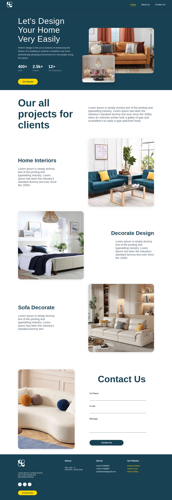
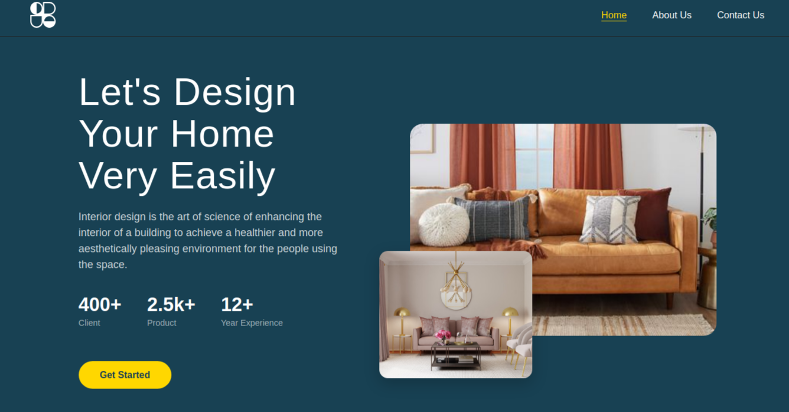
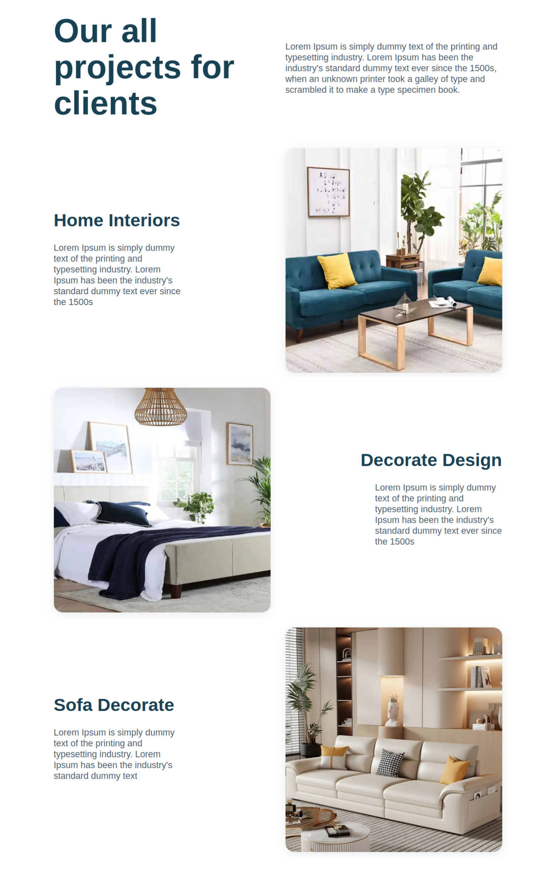
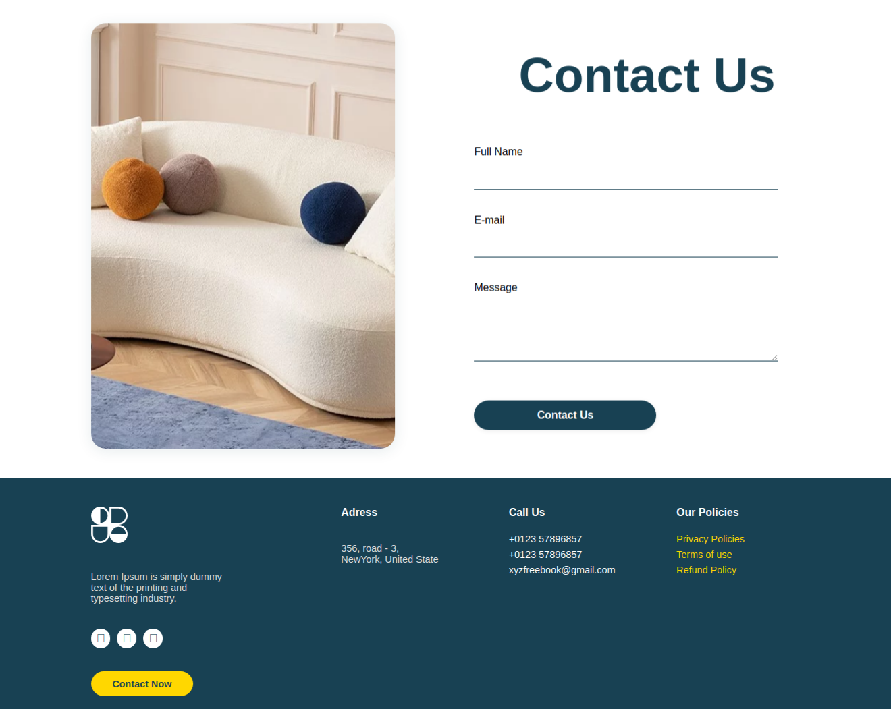

# Modern Furniture Landing Page

A sophisticated, responsive landing page built with Angular for a modern furniture brand. This standalone application showcases elegant furniture designs, interior projects, and brand aesthetics.

## Project Overview

This landing page utilizes Angular's standalone components architecture, featuring an elegant and luxurious design perfect for furniture and interior design brands. The page incorporates smooth animations, parallax effects, and a refined color palette that emphasizes the premium nature of the furniture products.

## Features

- Elegant responsive design (Mobile, Tablet, Desktop)
- Custom font integration (Angkor-Regular)
- Parallax scrolling effects
- Modern component architecture
- Premium UI/UX design
- Interactive elements
- Optimized performance

## Screenshots

### Complete Landing Page

*Comprehensive view of the modern furniture landing page showcasing elegant design and premium aesthetics*

### Hero Section

*Striking hero section featuring premium furniture with overlay effects and compelling call-to-action*

### Our Projects

*Gallery of completed interior design projects and furniture installations*

### Contact & Footer

*Professional contact form and comprehensive footer with brand information*

## Components Structure

```
src/
├── app/
│   ├── components/
│   │   ├── navbar/          # Navigation with logo
│   │   ├── hero-section/    # Main showcase area
│   │   ├── about-us/        # Company information
│   │   ├── contact/         # Contact form
│   │   └── footer/          # Site footer
│   └── ...
└── assets/
    ├── images/
    │   ├── hero-main.png
    │   ├── hero-overlay.png
    │   ├── about-sofa.png
    │   ├── about-interior.png
    │   ├── about-decorate.png
    │   ├── contact-image.png
    │   └── logo.svg
    ├── font/
    │   └── Angkor-Regular.ttf
    └── screenshots/
```

## Technology Stack

- Angular (Latest Version)
- Standalone Components
- CSS Variables & Custom Properties
- Responsive Design
- Custom Typography
- Modern JavaScript/TypeScript

## Color Scheme

- Primary Color: #2C3639 (Deep Charcoal)
- Secondary Color: #A27B5C (Warm Brown)
- Accent Color: #DCD7C9 (Soft Cream)
- Text Color: #3F4E4F (Muted Green-Gray)

## Getting Started

1. Clone the repository
```bash
git clone [repository-url]
```

2. Install dependencies
```bash
npm install
```

3. Run development server
```bash
ng serve
```

4. Open browser and navigate to
```
http://localhost:4200
```

## Customization

### Assets
- Replace images in `src/assets/images/`
- Update logo: `logo.svg`
- Hero images: `hero-main.png`, `hero-overlay.png`
- About section: `about-sofa.png`, `about-interior.png`, `about-decorate.png`
- Contact: `contact-image.png`

### Typography
- Custom font in `src/assets/font/`
- Font variables in global CSS

### Styling
- Global styles in `src/styles.css`
- Component-specific styles in respective folders
- CSS variables for easy theme customization

## Build for Production

```bash
ng build --configuration=production
```

## Performance Features

- Lazy loaded images
- Optimized assets
- Efficient component architecture
- Minimal third-party dependencies
- Responsive image loading

## Browser Support

- Chrome (latest)
- Firefox (latest)
- Safari (latest)
- Edge (latest)

## Contributing

1. Fork the repository
2. Create your feature branch
3. Commit your changes
4. Push to the branch
5. Create a new Pull Request

## License

[MIT License](LICENSE)

## Contact

For any queries or support, please open an issue in the repository.
